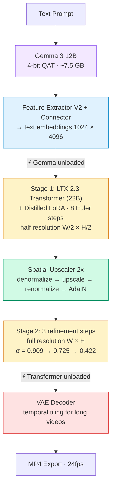
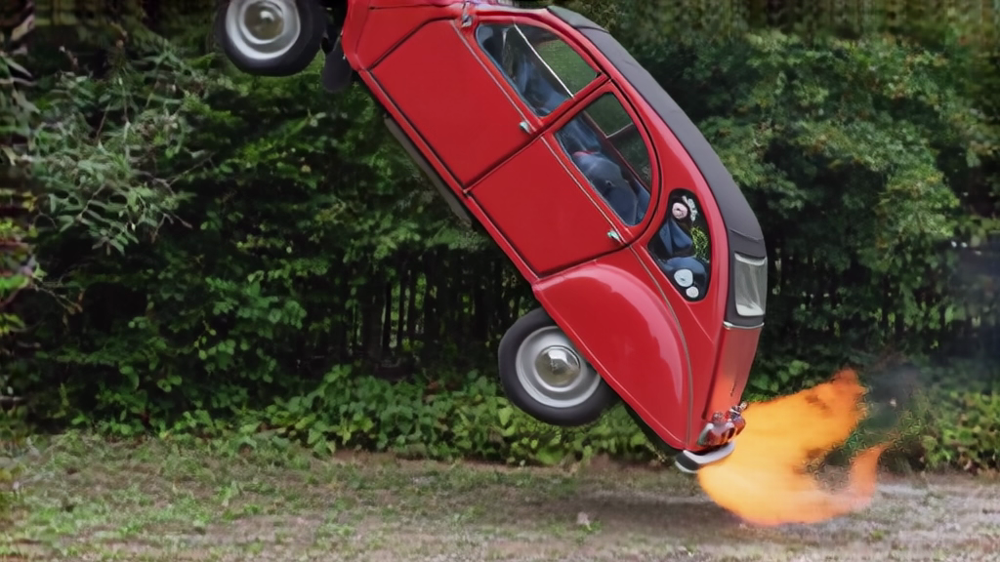
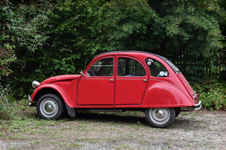
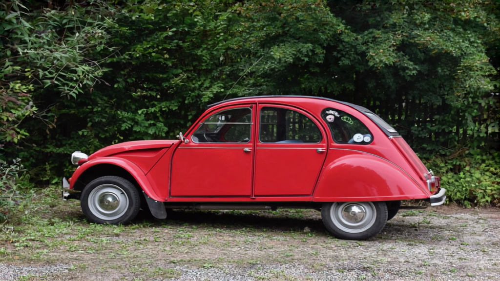

# LTX-Video-Swift-MLX

Swift implementation of [LTX-2.3](https://github.com/Lightricks/LTX-2) video generation, optimized for Apple Silicon using [MLX](https://github.com/ml-explore/mlx-swift). Runs entirely on-device.

## Features

| Feature | Status | Notes |
|---------|--------|-------|
| Text-to-Video (two-stage distilled) | **Done** | Matches HuggingFace Space quality |
| Image-to-Video (two-stage distilled) | **Done** | Condition on first frame |
| Video-to-Video (Retake) | **Done** | Full + partial temporal retake |
| Audio generation (I2V + audio) | **Done** | Dual video/audio denoising |
| LoRA inference | **Done** | Fuse any LTX-2.3 compatible LoRA |
| LoRA training (QLoRA) | **Beta** | Fine-tune 22B transformer on Apple Silicon |
| Quantization (qint8/int4) | **Done** | [Benchmarked](docs/benchmarks/) — int4 halves memory |

## Requirements

- macOS 26.3+ (Tahoe)
- Apple Silicon Mac (M1/M2/M3/M4)
- 32 GB+ unified memory recommended
- Xcode 26+

## Quick Start

### Option 1: Download the pre-built CLI (fastest)

Grab the latest release binary from the [Releases page](https://github.com/VincentGourbin/ltx-video-swift-mlx/releases) — no build step required.

### Option 2: Build from source

> **Important**: Use `xcodebuild` (not `swift build`) to run the CLI. MLX requires Metal shaders (`default.metallib`) that are only bundled correctly by `xcodebuild`. `swift build` works for syntax checking but the resulting binary will fail at runtime with a "metallib not found" error. See [#3](https://github.com/VincentGourbin/ltx-video-swift-mlx/issues/3).

```bash
git clone https://github.com/VincentGourbin/ltx-video-swift-mlx.git
cd ltx-video-swift-mlx

# Build Release
xcodebuild -scheme ltx-video -configuration Release -derivedDataPath .xcodebuild \
  -destination 'platform=macOS' build

# Run from the build directory (required — the metallib bundle must be alongside the binary)
.xcodebuild/Build/Products/Release/ltx-video generate "A cat" -w 768 -h 512 -f 121
```

To run from another location, copy both the binary and its resource bundle:
```bash
cp .xcodebuild/Build/Products/Release/ltx-video /usr/local/bin/
cp -R .xcodebuild/Build/Products/Release/mlx-swift_Cmlx.bundle /usr/local/bin/
```

### Generate a Video

```bash
# Standard quality (768x512, 5 seconds)
ltx-video generate "A cat walking on the beach" -w 768 -h 512 -f 121

# High resolution (1024x576, 10 seconds)
ltx-video generate "Ocean waves at sunset" -w 1024 -h 576 -f 241

# With prompt enhancement (recommended)
ltx-video generate "A beaver building a dam" -w 768 -h 512 -f 121 --enhance-prompt

# With quantization (lower memory)
ltx-video generate "A sunset over mountains" -w 768 -h 512 -f 121 --transformer-quant qint8
```

### Image-to-Video

```bash
ltx-video generate "The car drives away into the sunset" \
    --image photo.png -w 768 -h 512 -f 121 --enhance-prompt
```

### Keyframe Interpolation

Pin generation to one or more reference images at chosen pixel positions —
first frame, optional middle frame(s), and/or last frame, in any combination.
`--keyframe PATH:FRAME_IDX` is repeatable; `--image PATH` is shorthand for
`--keyframe PATH:0`.

```bash
# Last-frame anchor: free start, video ends on the reference image
ltx-video generate "A car descends from the sky and lands softly on a road" \
    --keyframe photo.png:120 -w 768 -h 512 -f 121 --audio

# Loop: same image at start and end
ltx-video generate "The car takes off into the sky, then returns to its parking spot" \
    --keyframe photo.png:0 --keyframe photo.png:120 -w 768 -h 512 -f 121

# Mid-anchor: free intro, fixed middle, free outro
ltx-video generate "Descending through clouds, parks here, then takes off again" \
    --keyframe photo.png:120 -w 768 -h 512 -f 241 --audio
```

Latent stride is 8 — two keyframes within the same 8-pixel-frame group
(e.g. pixel 1 and pixel 8) collide on the same latent slot and are rejected.
See [docs/examples/keyframe-interpolation/](docs/examples/keyframe-interpolation/)
for validated end-to-end examples and timings.

### LoRA

```bash
# Apply a LoRA during generation
ltx-video generate "arc shot, camera orbiting the subject, a red car on a road" \
    --image photo.png \
    --lora /path/to/lora.safetensors \
    -w 768 -h 512 -f 121

# Adjust LoRA strength
ltx-video generate "arc shot, camera orbiting the subject" \
    --lora /path/to/lora.safetensors --lora-scale 0.5
```

### Retake (Video-to-Video)

Retake regenerates a specific time region of a video from a text prompt while keeping the rest unchanged. It works best on videos **5 seconds or longer** — shorter videos don't give the model enough temporal context to produce visible changes.

**Prompt guidelines** (from our testing, two styles work best):
- **Full scene description**: describe the entire scene including your modification — *"A cute Groot character walking in a city street, a giant fireball with flames flies through the air, 3D Pixar style"*
- **Replacement instruction**: tell the model what to replace — *"Replace the red ball with a fireball with blazing flames and sparks"*

Avoid prompts that only describe the new element without context (e.g., just *"A fireball"*) — the model needs scene context to blend coherently.

```bash
# Full retake: regenerate entire video with new prompt
ltx-video retake "A cat building a dam in a forest stream" \
    --video source.mp4 -w 768 -h 512 -f 121

# Partial retake: regenerate seconds 5-7 of a 10s video
ltx-video retake "Replace the red ball with a fireball with blazing flames and sparks" \
    --video source.mp4 \
    --start-time 5.0 --end-time 7.0 -w 512 -h 512 -f 233

# Use distilled mode for faster inference (default: dev model with CFG)
ltx-video retake "The vase explodes into colorful smoke" \
    --video source.mp4 --distilled \
    --start-time 7.0 --end-time 10.0 -w 768 -h 512 -f 241
```

### Audio

```bash
ltx-video generate "A car engine starting" \
    --image car.png --audio -w 768 -h 512 -f 121
```

### LoRA Training (Beta)

> **Status**: Theoretically functional, currently under validation. The full training pipeline runs end-to-end (dataset loading, latent caching, gradient computation, checkpoint saving, LoRA export). Validation is in progress with the [Cakeify dataset](https://huggingface.co/datasets/Lightricks/Cakeify-Dataset).

Train a LoRA on the dev model using QLoRA (quantized base weights) to fit on Apple Silicon:

```bash
# Prepare dataset: directory of video.mp4 + video.txt pairs
# Each .txt file contains a caption for the corresponding video

# Train with trigger word (e.g., Cakeify style)
ltx-video train dataset/ -o /tmp/my-lora \
    --model dev --rank 16 --steps 2000 --save-every 250 \
    -w 512 -h 512 -f 121 --transformer-quant qint8 \
    --lora-blocks 16 --trigger-word "MYSTYLE"

# Use the trained LoRA for generation
ltx-video generate "MYSTYLE a red car on a road" \
    --lora /tmp/my-lora/lora-final.safetensors \
    -w 768 -h 512 -f 121
```

A `learning_curve.svg` is generated live in the output directory for monitoring.

**Selective LoRA blocks**: `--lora-blocks 16` trains only the last 16 of 48 transformer blocks, cutting backward graph memory via `stopGradient()`. This enables training at higher resolutions and frame counts (e.g. 512×512×121f on 96GB). The last blocks control style and texture — sufficient for most style-transfer LoRAs.

**Aspect ratio**: training videos are automatically resized to fit within the `--width`/`--height` budget while preserving their native aspect ratio (dimensions rounded to 32). No stretching or distortion.

**Memory presets** (all use int4 quantization for the 22B model):

| Preset | RAM | Rank | Resolution | Frames |
|--------|-----|------|-----------|--------|
| `compact` | 32GB | 16 | 256x256 | 9 |
| `balanced` | 64GB | 32 | 384x384 | 9 |
| `quality` | 96GB | 64 | 512x512 | 9 |
| `max` | 192GB+ | 128 | 512x512 (bf16) | 9 |

Models (~30 GB total) are downloaded automatically on first run from [Lightricks/LTX-2.3](https://huggingface.co/Lightricks/LTX-2.3) and [mlx-community/gemma-3-12b-it-qat-4bit](https://huggingface.co/mlx-community/gemma-3-12b-it-qat-4bit).

## Swift Package Integration

Add to your `Package.swift`:

```swift
dependencies: [
    .package(url: "https://github.com/VincentGourbin/ltx-video-swift-mlx.git", branch: "main")
]
```

### Inference

```swift
import LTXVideo

let pipeline = LTXPipeline(model: .distilled)
try await pipeline.loadModels()
let upscalerPath = try await pipeline.downloadUpscalerWeights()

let config = LTXVideoGenerationConfig(width: 768, height: 512, numFrames: 121)
let result = try await pipeline.generateVideo(
    prompt: "A cat walking in a garden",
    config: config,
    upscalerWeightsPath: upscalerPath
)

try await VideoExporter.exportVideo(
    frames: result.frames, width: 768, height: 512,
    to: URL(fileURLWithPath: "output.mp4")
)
```

#### Keyframe Interpolation

Constrain generation to pass through one or more reference images at chosen
pixel positions. The legacy `imagePath` field is preserved as a single keyframe
at pixel 0 (mathematically equivalent to before for the default
`imageCondNoiseScale = 0`).

```swift
import LTXVideo

let config = LTXVideoGenerationConfig(
    width: 768, height: 512, numFrames: 241,
    seed: 42,
    keyframes: [
        KeyframeInput(path: "/abs/path/start.png", pixelFrameIndex: 0),
        KeyframeInput(path: "/abs/path/end.png",   pixelFrameIndex: 240)
    ]
)
try config.validate()  // throws on missing file, range, slot collision, strength != 1.0

let result = try await pipeline.generateVideo(
    prompt: "Smooth transition between two scenes",
    config: config,
    upscalerWeightsPath: upscalerPath
)
```

`KeyframeInput` fields:
- `path: String` — image file path (any format `loadImage` accepts).
- `pixelFrameIndex: Int` — target pixel position, in `[0, numFrames - 1]`.
- `strength: Float` — must be `1.0` (hard injection); soft conditioning not yet wired.

Helpers exposed for advanced use:
- `pixelFrameToLatentFrame(_:)` — maps pixel index to latent slot (stride 8).
- `validateKeyframes(_:numFrames:)` — same checks as `LTXVideoGenerationConfig.validate()` runs.

### LoRA Training (Beta)

```swift
import LTXVideo

let config = LoRATrainingConfig(
    rank: 64,
    learningRate: 2e-4,
    maxSteps: 2000,
    saveEvery: 500,
    width: 384,
    height: 384,
    numFrames: 9,
    transformerQuant: "int4",
    triggerWord: "MYSTYLE",
    ltxWeightsPath: "/path/to/ltx-2.3-22b-dev.safetensors"
)

let trainer = LoRATrainer(
    config: config,
    datasetPath: "/path/to/dataset",  // mp4 + txt pairs
    outputDir: "/tmp/my-lora"
)

try await trainer.train { progress in
    print(progress.status)  // "Step 42/2000 [2%] loss=0.523 lr=2.00e-04"
}
// Outputs: lora-final.safetensors, checkpoint-stepN.safetensors, learning_curve.svg
```

### Model Registry

```swift
import LTXVideo

// List available models
for model in LTXModel.allCases {
    print("\(model.rawValue): inference=\(model.isForInference), training=\(model.isForTraining)")
    print("  \(model.variantDescription)")
    print("  Size: \(model.estimatedSizeGB)GB, License: \(model.license)")
}

// Print formatted table
LTXModel.printModelList()

// Check system compatibility
let ram = LTXModelRegistry.systemRAMGB
print("System RAM: \(ram) GB")
```

## Pipeline Architecture

The `generate` command runs a **two-stage distilled pipeline** matching the [LTX-2 HuggingFace Space](https://huggingface.co/spaces/Lightricks/LTX-2):



## CLI Reference

### `ltx-video generate`

| Flag | Default | Description |
|------|---------|-------------|
| `<prompt>` | required | Text prompt |
| `-o, --output` | `output.mp4` | Output file path |
| `-w, --width` | `768` | Video width (divisible by 64) |
| `-h, --height` | `512` | Video height (divisible by 64) |
| `-f, --frames` | `121` | Frame count (must be 8n+1) |
| `--seed` | random | Random seed |
| `--image` | none | Input image for I2V (shorthand for `--keyframe PATH:0`) |
| `--keyframe` | none | Repeatable keyframe spec `PATH:FRAME_IDX[:STRENGTH]` (mutually exclusive with `--image`) |
| `--lora` | none | Path to LoRA .safetensors file |
| `--lora-scale` | `1.0` | LoRA strength (0.0–1.0) |
| `--audio` | off | Enable audio generation |
| `--audio-gain` | `1.0` | Audio gain (linear) |
| `--enhance-prompt` | off | Enhance prompt with Gemma VLM |
| `--transformer-quant` | `bf16` | Quantization: `bf16`, `qint8`, `int4`, `nvfp4`, `mxfp8` |
| `--mixed-precision` | off | Per-block quantization: first/last 6 blocks qint8, middle int4 |
| `--bitrate` | auto | Video bitrate in kbps |
| `--debug` | off | Debug output |
| `--profile` | off | GPU/CPU profiling report + Chrome Trace export |

### `ltx-video export-quantized`

Export a quantized transformer to safetensors for reuse (skip on-the-fly quantization).

```bash
ltx-video export-quantized \
    --input /path/to/ltx-2.3-22b-distilled.safetensors \
    --output /path/to/ltx-2.3-22b-distilled-nvfp4.safetensors \
    --mode nvfp4
```

| Flag | Default | Description |
|------|---------|-------------|
| `--input` | required | Path to bf16 unified weights |
| `-o, --output` | required | Output safetensors path |
| `--mode` | `nvfp4` | Quantization mode: `nvfp4`, `mxfp8`, `qint8`, `int4` |

### `ltx-video retake`

| Flag | Default | Description |
|------|---------|-------------|
| `<prompt>` | required | New text prompt (describe full scene or replacement instruction) |
| `--video` | required | Source video path |
| `--start-time` | none | Start of region to regenerate (seconds) |
| `--end-time` | none | End of region to regenerate (seconds) |
| `-o, --output` | `retake.mp4` | Output file path |
| `-w, --width` | `768` | Video width (divisible by 32) |
| `-h, --height` | `512` | Video height (divisible by 32) |
| `-f, --frames` | `121` | Frame count (must be 8n+1) |
| `--seed` | random | Random seed |
| `--distilled` | off | Use distilled model (8 steps, fast). Default: dev (30 steps + CFG) |
| `--enhance-prompt` | off | Enhance prompt with Gemma VLM |
| `--transformer-quant` | `bf16` | Quantization: `bf16`, `qint8`, `int4`, `nvfp4`, `mxfp8` |
| `--mixed-precision` | off | Per-block quantization: first/last 6 blocks qint8, middle int4 |
| `--regenerate-audio` | off | Regenerate audio via dual denoising (default: preserve source audio) |
| `--profile` | off | GPU/CPU profiling report + Chrome Trace export |

### `ltx-video train`

| Flag | Default | Description |
|------|---------|-------------|
| `<dataset>` | required | Path to dataset directory (mp4 + txt pairs) |
| `-o, --output` | required | Output directory for checkpoints and LoRA |
| `--model` | `dev` | Model variant (`dev` required for training) |
| `--rank` | `16` | LoRA rank |
| `--alpha` | same as rank | LoRA alpha |
| `--lr` | `2e-4` | Learning rate |
| `--steps` | `2000` | Max training steps |
| `--save-every` | `250` | Checkpoint interval |
| `-w, --width` | `256` | Training video width (divisible by 32) |
| `-h, --height` | `256` | Training video height (divisible by 32) |
| `-f, --frames` | `9` | Frame count (must be 8n+1) |
| `--transformer-quant` | `bf16` | Quantization: `bf16`, `qint8`, `int4`, `nvfp4`, `mxfp8` |
| `--lora-blocks` | `0` | Train only last N blocks (0 = all). Reduces memory for long videos |
| `--trigger-word` | none | Trigger word to prepend to captions |
| `--grad-accum` | `1` | Gradient accumulation steps |
| `--max-grad-norm` | `1.0` | Gradient clipping norm |
| `--warmup-steps` | `100` | LR warmup steps |
| `--preset` | none | Memory preset: `compact`, `balanced`, `quality`, `max` |

### `ltx-video models`

List available models with capabilities (inference, training, license).

### `ltx-video download`

Pre-download model weights.

### `ltx-video info`

Show version and pipeline information.

## Examples

See [docs/examples/](docs/examples/) for generation examples with parameters and videos.

### Text-to-Video (10 seconds, 1024x576)

[](https://github.com/VincentGourbin/ltx-video-swift-mlx/raw/main/docs/examples/text-to-video/t2v-1024x576-10s.mp4)

*"A beaver building a dam in a peaceful forest stream, golden hour lighting" — 241 frames, two-stage distilled, prompt enhanced. [Full details →](docs/examples/text-to-video/)*

### Image-to-Video (10 seconds, 1024x576)

[](https://github.com/VincentGourbin/ltx-video-swift-mlx/raw/main/docs/examples/image-to-video/i2v-1024x576-10s.mp4)

*Red 2CV taking off Back to the Future style — from input image, 241 frames, prompt enhanced. [Full details →](docs/examples/image-to-video/)*

### LoRA — Camera Arcshot (5 seconds, 768x512)

| With arcshot LoRA | Without LoRA |
|---|---|
| [](https://github.com/VincentGourbin/ltx-video-swift-mlx/raw/main/docs/examples/lora/i2v-arcshot-v2-lora.mp4) | [](https://github.com/VincentGourbin/ltx-video-swift-mlx/raw/main/docs/examples/lora/i2v-arcshot-v2-nolora.mp4) |

*Same prompt and seed — the LoRA adds arc shot camera movement. [Full details →](docs/examples/lora/)*

### Image-to-Video + Audio (10 seconds, 1024x576)

[](https://github.com/VincentGourbin/ltx-video-swift-mlx/raw/main/docs/examples/audio/i2v-audio-1024x576-10s.mp4)

*Red 2CV engine start with synchronized audio — dual video/audio denoising, 241 frames. [Full details →](docs/examples/audio/)*

### Full Retake — Beaver to Cat (5 seconds, 768x512)

[](https://github.com/VincentGourbin/ltx-video-swift-mlx/raw/main/docs/examples/retake/retake-full-768x512-5s.mp4)

*Source beaver video regenerated as a cat — strength 0.8, prompt enhanced, 121 frames. [Full details →](docs/examples/retake/)*

### Partial Retake — Vase Explodes (10 seconds, 768x512)

[](https://github.com/VincentGourbin/ltx-video-swift-mlx/raw/main/docs/examples/retake/retake-partial-768x512-10s.mp4)

*Last 3 seconds regenerated with exploding vase — first 7s preserved from source, 241 frames. [Full details →](docs/examples/retake/)*

## Performance

Benchmarked on Apple Silicon **M3 Max 96GB**, macOS 26.3 (Tahoe).

### I2V + Audio — 1024x576, 241 frames (10s)

| Quantization | Generation Time | Peak GPU | Mean GPU (denoise) | Audio Quality |
|---|---|---|---|---|
| **bf16** (default) | 1145s | 54.8 GB | 49.7 GB | -11.7 dBFS peak |
| **qint8** | 1458s | 44.6 GB | 32.7 GB | -12.2 dBFS peak |
| **int4** | 1294s | 38.4 GB | 23.7 GB | -11.9 dBFS peak |

- **bf16** is fastest when the model fits in memory (96GB+)
- **int4** halves denoising memory (24 GB vs 50 GB) — enables 32-64 GB machines
- Audio quality is preserved across all quantization levels

See [docs/benchmarks/](docs/benchmarks/) for full benchmark details and methodology.

## Constraints

- **Frame count**: Must be `8n + 1` (9, 17, 25, 33, 41, 49, 57, 65, 73, 81, 89, 97, 105, 113, 121, ...)
- **Resolution**: Width and height divisible by 64
- **Recommended**: 768x512, 1024x576, 832x480

## Credits

- [LTX-2](https://github.com/Lightricks/LTX-2) by Lightricks
- [MLX](https://github.com/ml-explore/mlx-swift) by Apple
- [Gemma 3](https://ai.google.dev/gemma) by Google

## License

MIT License. See [LICENSE](LICENSE).
