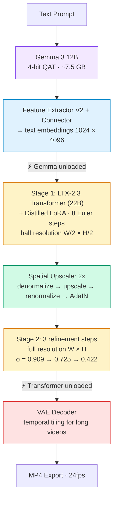

# LTX-Video-Swift-MLX

Swift implementation of [LTX-2.3](https://github.com/Lightricks/LTX-2) video generation, optimized for Apple Silicon using [MLX](https://github.com/ml-explore/mlx-swift). Runs entirely on-device.

## Features

| Feature | Status | Notes |
|---------|--------|-------|
| Text-to-Video (two-stage distilled) | **Done** | Matches HuggingFace Space quality |
| Image-to-Video (two-stage distilled) | **Done** | Condition on first frame |
| Video-to-Video (Retake) | **Done** | Full + partial temporal retake |
| Audio generation (I2V + audio) | **Done** | Dual video/audio denoising |
| Quantization (qint8/int4) | **Done** | [Benchmarked](docs/benchmarks/) — int4 halves memory |

## Requirements

- macOS 26.3+ (Tahoe)
- Apple Silicon Mac (M1/M2/M3/M4)
- 32 GB+ unified memory recommended
- Xcode 26+

## Quick Start

### Build

```bash
git clone https://github.com/VincentGourbin/ltx-video-swift-mlx.git
cd ltx-video-swift-mlx
swift build
```

Or build Release with Xcode:
```bash
xcodebuild -scheme ltx-video -configuration Release -derivedDataPath .xcodebuild \
  -destination 'platform=macOS' build
```

### Generate a Video

```bash
# Standard quality (768x512, 5 seconds)
ltx-video generate "A cat walking on the beach" -w 768 -h 512 -f 121

# High resolution (1024x576, 10 seconds)
ltx-video generate "Ocean waves at sunset" -w 1024 -h 576 -f 241

# With prompt enhancement (recommended)
ltx-video generate "A beaver building a dam" -w 768 -h 512 -f 121 --enhance-prompt

# With quantization (lower memory)
ltx-video generate "A sunset over mountains" -w 768 -h 512 -f 121 --transformer-quant qint8
```

### Retake (Video-to-Video)

```bash
# Full retake: regenerate entire video with new prompt
ltx-video retake "A cat building a dam in a forest stream" \
    --video source.mp4 --strength 0.8 -w 768 -h 512 -f 121

# Partial retake: regenerate only seconds 7-10
ltx-video retake "The vase explodes into colorful smoke" \
    --video source.mp4 --strength 0.75 \
    --start-time 7.0 --end-time 10.0 -w 768 -h 512 -f 241
```

Models (~30 GB total) are downloaded automatically on first run from [Lightricks/LTX-2](https://huggingface.co/Lightricks/LTX-2) and [mlx-community/gemma-3-12b-it-qat-4bit](https://huggingface.co/mlx-community/gemma-3-12b-it-qat-4bit).

## Pipeline Architecture

The `generate` command runs a **two-stage distilled pipeline** matching the [LTX-2 HuggingFace Space](https://huggingface.co/spaces/Lightricks/LTX-2):



## CLI Reference

### `ltx-video generate`

| Flag | Default | Description |
|------|---------|-------------|
| `<prompt>` | required | Text prompt |
| `-o, --output` | `output.mp4` | Output file path |
| `-w, --width` | `768` | Video width (divisible by 64) |
| `-h, --height` | `512` | Video height (divisible by 64) |
| `-f, --frames` | `121` | Frame count (must be 8n+1) |
| `--seed` | random | Random seed |
| `--image` | none | Input image for I2V |
| `--audio` | off | Enable audio generation |
| `--enhance-prompt` | off | Enhance prompt with Gemma VLM |
| `--transformer-quant` | `bf16` | Quantization: `bf16`, `qint8`, `int4` |
| `--debug` | off | Debug output |
| `--profile` | off | Timing/memory breakdown |

### `ltx-video retake`

| Flag | Default | Description |
|------|---------|-------------|
| `<prompt>` | required | New text prompt |
| `--video` | required | Source video path |
| `--strength` | `0.8` | How much to change (0.0 = keep, 1.0 = full regen) |
| `--start-time` | none | Start of region to regenerate (seconds) |
| `--end-time` | none | End of region to regenerate (seconds) |
| `-o, --output` | `retake.mp4` | Output file path |
| `-w, --width` | `768` | Video width (divisible by 64) |
| `-h, --height` | `512` | Video height (divisible by 64) |
| `-f, --frames` | `121` | Frame count (must be 8n+1) |
| `--seed` | random | Random seed |
| `--enhance-prompt` | off | Enhance prompt with Gemma VLM |
| `--transformer-quant` | `bf16` | Quantization: `bf16`, `qint8`, `int4` |

### `ltx-video download`

Pre-download model weights.

### `ltx-video info`

Show version and pipeline information.

## Examples

See [docs/examples/](docs/examples/) for generation examples with parameters and videos.

### Text-to-Video (10 seconds, 1024x576)

[](https://github.com/VincentGourbin/ltx-video-swift-mlx/raw/main/docs/examples/text-to-video/t2v-1024x576-10s.mp4)

*"A beaver building a dam in a peaceful forest stream, golden hour lighting" — 241 frames, two-stage distilled, prompt enhanced. [Full details →](docs/examples/text-to-video/)*

### Image-to-Video (10 seconds, 1024x576)

[](https://github.com/VincentGourbin/ltx-video-swift-mlx/raw/main/docs/examples/image-to-video/i2v-1024x576-10s.mp4)

*Red 2CV taking off Back to the Future style — from input image, 241 frames, prompt enhanced. [Full details →](docs/examples/image-to-video/)*

### Image-to-Video + Audio (10 seconds, 1024x576)

[](https://github.com/VincentGourbin/ltx-video-swift-mlx/raw/main/docs/examples/audio/i2v-audio-1024x576-10s.mp4)

*Red 2CV engine start with synchronized audio — dual video/audio denoising, 241 frames. [Full details →](docs/examples/audio/)*

### Full Retake — Beaver to Cat (5 seconds, 768x512)

[](https://github.com/VincentGourbin/ltx-video-swift-mlx/raw/main/docs/examples/retake/retake-full-768x512-5s.mp4)

*Source beaver video regenerated as a cat — strength 0.8, prompt enhanced, 121 frames. [Full details →](docs/examples/retake/)*

### Partial Retake — Vase Explodes (10 seconds, 768x512)

[](https://github.com/VincentGourbin/ltx-video-swift-mlx/raw/main/docs/examples/retake/retake-partial-768x512-10s.mp4)

*Last 3 seconds regenerated with exploding vase — first 7s preserved from source, 241 frames. [Full details →](docs/examples/retake/)*

## Performance

Benchmarked on Apple Silicon **M3 Max 96GB**, macOS 26.3 (Tahoe).

### I2V + Audio — 1024x576, 241 frames (10s)

| Quantization | Generation Time | Peak GPU | Mean GPU (denoise) | Audio Quality |
|---|---|---|---|---|
| **bf16** (default) | 1145s | 54.8 GB | 49.7 GB | -11.7 dBFS peak |
| **qint8** | 1458s | 44.6 GB | 32.7 GB | -12.2 dBFS peak |
| **int4** | 1294s | 38.4 GB | 23.7 GB | -11.9 dBFS peak |

- **bf16** is fastest when the model fits in memory (96GB+)
- **int4** halves denoising memory (24 GB vs 50 GB) — enables 32-64 GB machines
- Audio quality is preserved across all quantization levels

See [docs/benchmarks/](docs/benchmarks/) for full benchmark details and methodology.

## Constraints

- **Frame count**: Must be `8n + 1` (9, 17, 25, 33, 41, 49, 57, 65, 73, 81, 89, 97, 105, 113, 121, ...)
- **Resolution**: Width and height divisible by 64
- **Recommended**: 768x512, 1024x576, 832x480

## Credits

- [LTX-2](https://github.com/Lightricks/LTX-2) by Lightricks
- [MLX](https://github.com/ml-explore/mlx-swift) by Apple
- [Gemma 3](https://ai.google.dev/gemma) by Google

## License

MIT License. See [LICENSE](LICENSE).
