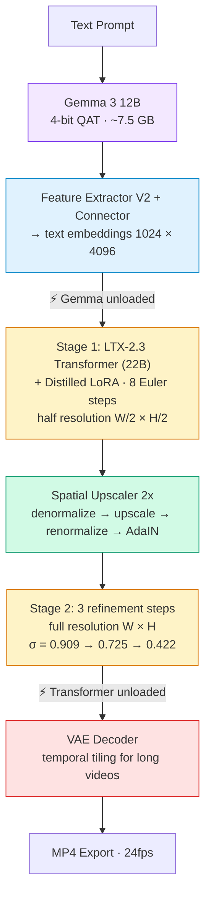

# LTX-Video-Swift-MLX

> **MAJOR CHANGE — WORK IN PROGRESS: LTX 2.3 Support**
>
> This project is being upgraded from LTX-2.0 to **LTX-2.3** (Lightricks, March 2026). The codebase is under active development. Some features are validated, others are pending adaptation.

Swift implementation of [LTX-2.3](https://github.com/Lightricks/LTX-2) video generation, optimized for Apple Silicon using [MLX](https://github.com/ml-explore/mlx-swift). Runs entirely on-device.

## LTX 2.3 Migration Status

| Feature | Status | Notes |
|---------|--------|-------|
| Text-to-Video (two-stage distilled) | **Done** | Matches HuggingFace Space quality |
| Image-to-Video | Pending | |
| Video-to-Video (Retake) | Pending | |
| Audio generation | Pending | |
| Quantization (qint8/int4) | Pending validation | |

## What's New in LTX 2.3

- **Unified Gemma VLM**: Single `gemma-3-12b-it-qat-4bit` (~7.5 GB) replaces per-variant bf16 text encoders (~24 GB each)
- **22B Transformer**: 48 blocks with gated attention, cross-attention AdaLN, SST (9 values)
- **Unified weights**: Single `.safetensors` file per variant, split at load time
- **Feature Extractor V2**: Per-token RMS norm + rescale (replaces V1 per-segment normalization)
- **Two-stage pipeline**: Built-in half-res generation + 2x spatial upscaling + refinement

## Requirements

- macOS 26.3+ (Tahoe)
- Apple Silicon Mac (M1/M2/M3/M4)
- 32 GB+ unified memory recommended
- Xcode 26+

## Quick Start

### Build

```bash
git clone https://github.com/VincentGourbin/ltx-video-swift-mlx.git
cd ltx-video-swift-mlx
swift build
```

Or build Release with Xcode:
```bash
xcodebuild -scheme ltx-video -configuration Release -derivedDataPath .xcodebuild \
  -destination 'platform=macOS' build
```

### Generate a Video

```bash
# Standard quality (768x512, 5 seconds)
ltx-video generate "A cat walking on the beach" -w 768 -h 512 -f 121

# High resolution (1024x576, 10 seconds)
ltx-video generate "Ocean waves at sunset" -w 1024 -h 576 -f 241

# With prompt enhancement (recommended)
ltx-video generate "A beaver building a dam" -w 768 -h 512 -f 121 --enhance-prompt

# With quantization (lower memory)
ltx-video generate "A sunset over mountains" -w 768 -h 512 -f 121 --transformer-quant qint8
```

Models (~30 GB total) are downloaded automatically on first run from [Lightricks/LTX-2](https://huggingface.co/Lightricks/LTX-2) and [mlx-community/gemma-3-12b-it-qat-4bit](https://huggingface.co/mlx-community/gemma-3-12b-it-qat-4bit).

## Pipeline Architecture

The `generate` command runs a **two-stage distilled pipeline** matching the [LTX-2 HuggingFace Space](https://huggingface.co/spaces/Lightricks/LTX-2):



## CLI Reference

### `ltx-video generate`

| Flag | Default | Description |
|------|---------|-------------|
| `<prompt>` | required | Text prompt |
| `-o, --output` | `output.mp4` | Output file path |
| `-w, --width` | `768` | Video width (divisible by 64) |
| `-h, --height` | `512` | Video height (divisible by 64) |
| `-f, --frames` | `121` | Frame count (must be 8n+1) |
| `--seed` | random | Random seed |
| `--image` | none | Input image for I2V |
| `--audio` | off | Enable audio generation |
| `--enhance-prompt` | off | Enhance prompt with Gemma VLM |
| `--transformer-quant` | `bf16` | Quantization: `bf16`, `qint8`, `int4` |
| `--debug` | off | Debug output |
| `--profile` | off | Timing/memory breakdown |

### `ltx-video download`

Pre-download model weights.

### `ltx-video info`

Show version and pipeline information.

## Examples

See [docs/examples/](docs/examples/) for generation examples with parameters and videos.

### Text-to-Video (10 seconds, 1024x576)

[](https://github.com/VincentGourbin/ltx-video-swift-mlx/raw/main/docs/examples/text-to-video/t2v-1024x576-10s.mp4)

*"A beaver building a dam in a peaceful forest stream, golden hour lighting" — 241 frames, two-stage distilled, prompt enhanced. [Full details →](docs/examples/text-to-video/)*

## Performance

*Work in progress — full benchmarks pending complete LTX 2.3 adaptation.*

Hardware: Apple Silicon M3 Max 96GB.

## Constraints

- **Frame count**: Must be `8n + 1` (9, 17, 25, 33, 41, 49, 57, 65, 73, 81, 89, 97, 105, 113, 121, ...)
- **Resolution**: Width and height divisible by 64
- **Recommended**: 768x512, 1024x576, 832x480

## Credits

- [LTX-2](https://github.com/Lightricks/LTX-2) by Lightricks
- [MLX](https://github.com/ml-explore/mlx-swift) by Apple
- [Gemma 3](https://ai.google.dev/gemma) by Google

## License

MIT License. See [LICENSE](LICENSE).
