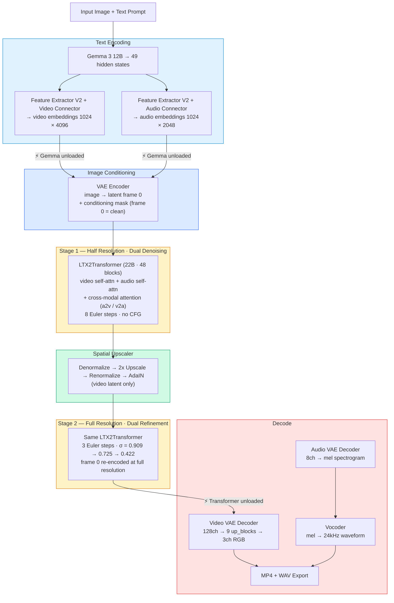
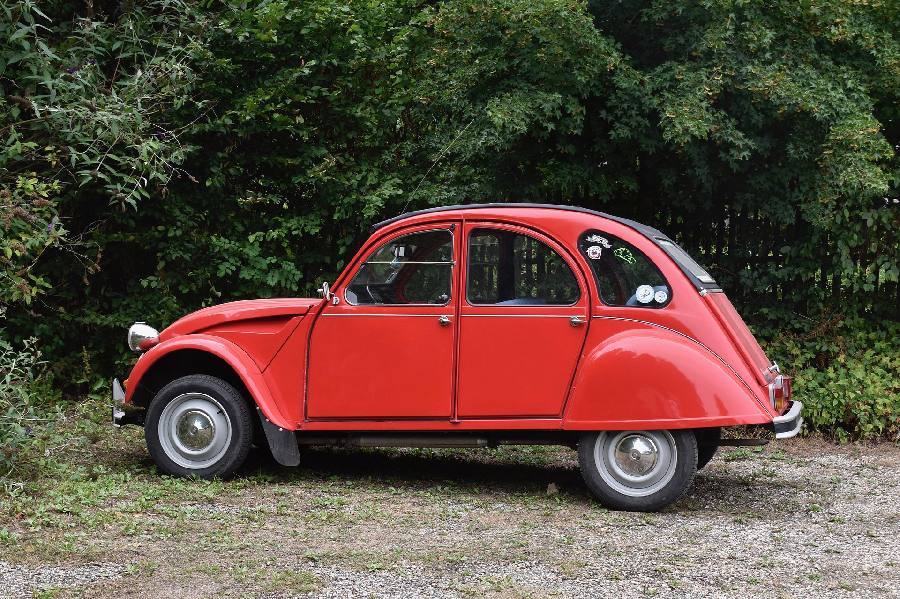
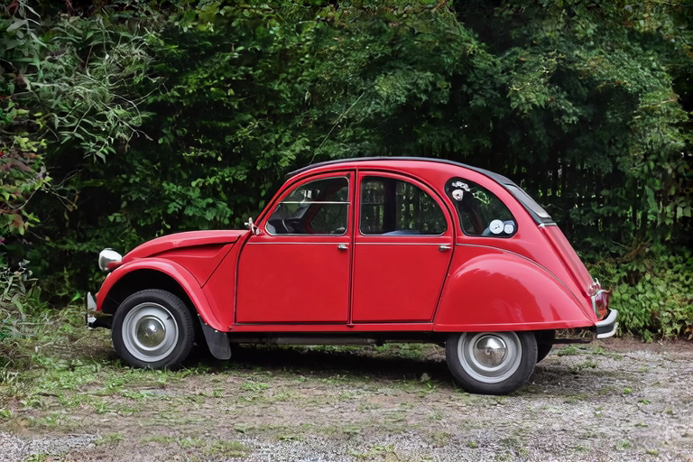

# Audio — LTX-2.3 Distilled Two-Stage Pipeline with Dual Video/Audio Denoising

Third validated use case: generate a video **with synchronized audio** from a single input image.

## Pipeline Architecture



### Difference from Image-to-Video (video only)

The audio pipeline replaces the video-only `LTXTransformer` with the dual-stream `LTX2Transformer`, which processes **video and audio latents simultaneously** through 48 transformer blocks. Each block contains:
- Video self-attention + audio self-attention
- Video cross-attention (text → video) + audio cross-attention (text → audio)
- Cross-modal attention: audio-to-video (a2v) and video-to-audio (v2a)
- Separate FFN for video and audio streams

Audio latents are decoded through the **Audio VAE** (mel spectrogram) then the **Vocoder** (waveform at 24kHz).

### Key Model Components

| Component | Source | Size |
|-----------|--------|------|
| Gemma 3 12B VLM | `mlx-community/gemma-3-12b-it-qat-4bit` | ~7.5 GB |
| LTX-2.3 Distilled (unified) | `Lightricks/LTX-2.3` → `ltx-2.3-22b-distilled.safetensors` | ~22 GB |
| Distilled LoRA | `Lightricks/LTX-2.3` → `ltx-2-19b-distilled-lora-384.safetensors` | ~1.5 GB |
| Spatial Upscaler | `Lightricks/LTX-2.3` → `latent_upsampler/diffusion_pytorch_model.safetensors` | ~50 MB |
| Audio VAE | `Lightricks/LTX-2` → `audio_vae/diffusion_pytorch_model.safetensors` | ~100 MB |
| Vocoder | `Lightricks/LTX-2` → `vocoder/diffusion_pytorch_model.safetensors` | ~106 MB |

All weights are auto-downloaded on first run.

---

## Examples

### Input Image

A red Citroën 2CV (same image as the I2V examples).



### 1. Quick Test — 768x512, 9 frames

```bash
ltx-video generate \
    "A chic woman walks towards a red vintage car, opens the door, gets inside and sits down. She starts the engine which roars like a lawnmower, then the car drives away down the road." \
    --image input_768x512.png \
    -w 768 -h 512 -f 9 \
    --seed 42 --audio \
    -o i2v-audio-768x512-9f.mp4
```

| Parameter | Value |
|-----------|-------|
| Resolution | 768x512 (stage 1: 384x256) |
| Frames | 9 (0.4s at 24fps) |
| Steps | 8 (stage 1) + 3 (stage 2) = 11 total |
| Seed | 42 |
| Audio | Yes (dual video/audio denoising) |
| Inference time | ~58s (M3 Max 96GB) |

[](https://github.com/VincentGourbin/ltx-video-swift-mlx/raw/main/docs/examples/audio/i2v-audio-768x512-9f.mp4)

*Click the image to download and play the video (with audio).*

---

### 2. Full Generation — 1024x576, 10 seconds

```bash
ltx-video generate \
    "A chic woman walks towards a red vintage car, opens the door, gets inside and sits down. She starts the engine which roars like a lawnmower, then the car drives away down the road." \
    --image input_768x512.png \
    -w 1024 -h 576 -f 241 \
    --seed 42 --audio \
    -o i2v-audio-1024x576-10s.mp4
```

| Parameter | Value |
|-----------|-------|
| Resolution | 1024x576 (stage 1: 512x288) |
| Frames | 241 (10.0s at 24fps) |
| Steps | 8 (stage 1) + 3 (stage 2) = 11 total |
| Seed | 42 |
| Audio | Yes (dual video/audio denoising) |
| Inference time | ~1462s (M3 Max 96GB) |

[](https://github.com/VincentGourbin/ltx-video-swift-mlx/raw/main/docs/examples/audio/i2v-audio-1024x576-10s.mp4)

*Click the image to download and play the video (with audio).*

---

## Hardware

- Apple Silicon M3 Max 96GB
- macOS 26.3 (Tahoe)
