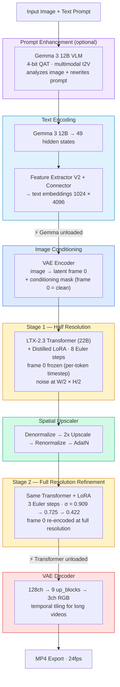
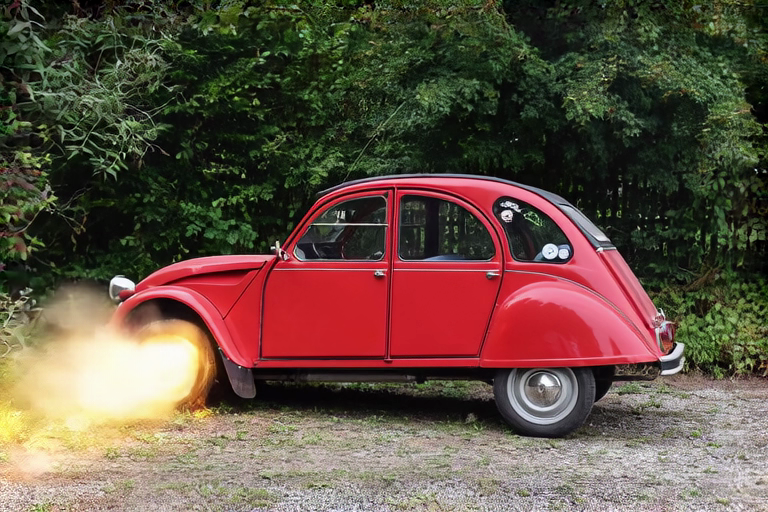

# Image-to-Video — LTX-2.3 Distilled Two-Stage Pipeline

Second validated use case: generate a video from a single input image.

## Pipeline Architecture



### Difference from Text-to-Video

The I2V pipeline adds **image conditioning**: the input image is VAE-encoded into latent frame 0, which is kept clean (not noised) via a **conditioning mask** with per-token timesteps. The transformer denoises all other frames while keeping frame 0 frozen, ensuring the output video starts from the exact input image.

---

## Examples

### Input Image

A red Citroën 2CV (resized from 1920x1280 to 768x512 for pipeline input).


### 1. Quick Test — 768x512, 9 frames

```bash
ltx-video generate \
    "The red vintage car's wheels fold up underneath, flames burst from the rear, and the car lifts off the ground into the sky like in Back to the Future, dramatic lighting, cinematic" \
    --image input_768x512.png \
    -w 768 -h 512 -f 9 \
    --seed 42 --enhance-prompt \
    -o i2v-768x512-9f.mp4
```

| Parameter | Value |
|-----------|-------|
| Resolution | 768x512 (stage 1: 384x256) |
| Frames | 9 (0.4s at 24fps) |
| Steps | 8 (stage 1) + 3 (stage 2) = 11 total |
| Seed | 42 |
| Prompt enhancement | Yes (multimodal I2V) |
| Inference time | ~39s (excl. model loading) |

[](https://github.com/VincentGourbin/ltx-video-swift-mlx/raw/main/docs/examples/image-to-video/i2v-768x512-9f.mp4)

*Click the image to download and play the video.*

---

### 2. Full Generation — 1024x576, 10 seconds

```bash
ltx-video generate \
    "The red vintage car's wheels fold up underneath, flames burst from the rear, and the car lifts off the ground into the sky like in Back to the Future, dramatic lighting, cinematic" \
    --image input_768x512.png \
    -w 1024 -h 576 -f 241 \
    --seed 42 --enhance-prompt \
    -o i2v-1024x576-10s.mp4
```

| Parameter | Value |
|-----------|-------|
| Resolution | 1024x576 (stage 1: 512x288) |
| Frames | 241 (10.0s at 24fps) |
| Steps | 8 (stage 1) + 3 (stage 2) = 11 total |
| Seed | 42 |
| Prompt enhancement | Yes (multimodal I2V) |
| Inference time | ~755s (~12.5 min, excl. model loading) |

[](https://github.com/VincentGourbin/ltx-video-swift-mlx/raw/main/docs/examples/image-to-video/i2v-1024x576-10s.mp4)

*Click the image to download and play the video.*

---

## Hardware

- Apple Silicon M3 Max 96GB
- macOS 26.3 (Tahoe)
- Inference times measured March 2026 (macOS 26.3, Release build)
