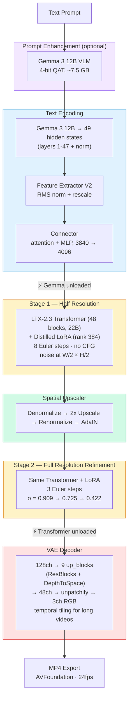
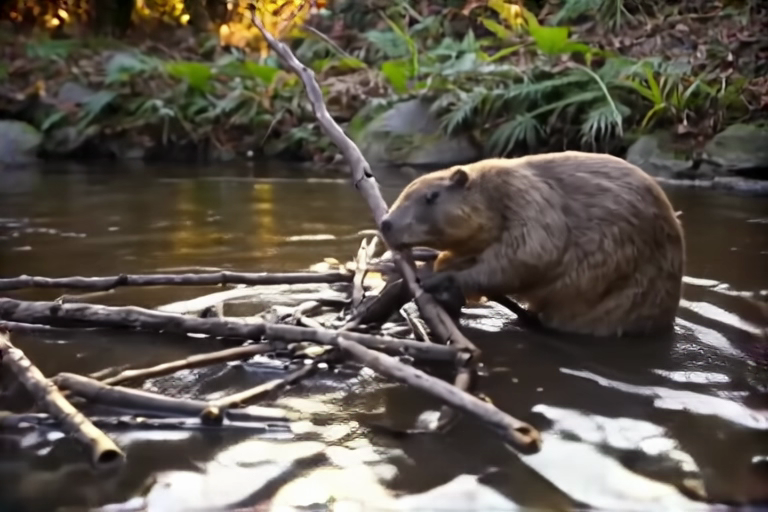
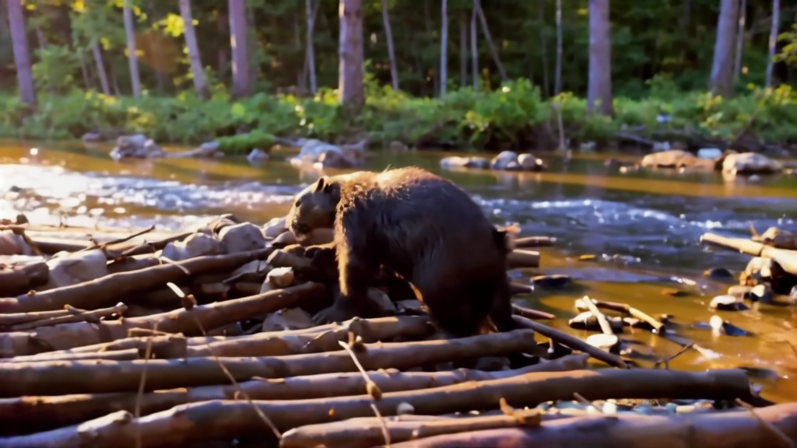

# Text-to-Video — LTX-2.3 Distilled Two-Stage Pipeline

First validated use case of the LTX-2.3 Swift/MLX port.

## Pipeline Architecture



### Key Model Components

| Component | Source | Size |
|-----------|--------|------|
| Gemma 3 12B VLM | `mlx-community/gemma-3-12b-it-qat-4bit` | ~7.5 GB |
| LTX-2.3 Distilled (unified) | `Lightricks/LTX-2` → `ltx-2.3-22b-distilled.safetensors` | ~22 GB |
| Distilled LoRA | `Lightricks/LTX-2` → `ltx-2-19b-distilled-lora-384.safetensors` | ~1.5 GB |
| Spatial Upscaler | `Lightricks/LTX-2` → `latent_upsampler/diffusion_pytorch_model.safetensors` | ~50 MB |

All weights are auto-downloaded on first run.

---

## Examples

### 1. Quick Test — 768x512, 9 frames

Short generation to validate the pipeline.

```bash
ltx-video generate \
    "A beaver building a dam in a peaceful forest stream, golden hour lighting" \
    -w 768 -h 512 -f 9 \
    --seed 1953802378 --enhance-prompt \
    -o t2v-768x512-9f.mp4
```

| Parameter | Value |
|-----------|-------|
| Resolution | 768x512 (stage 1: 384x256) |
| Frames | 9 (0.4s at 24fps) |
| Steps | 8 (stage 1) + 3 (stage 2) = 11 total |
| Seed | 1953802378 |
| Prompt enhancement | Yes (Gemma 3 12B) |
| Inference time | ~33s (excl. model loading) |

[](https://github.com/VincentGourbin/ltx-video-swift-mlx/raw/main/docs/examples/text-to-video/t2v-768x512-9f.mp4)

*Click the image to download and play the video.*

---

### 2. Full Generation — 1024x576, 10 seconds

Full-length high-resolution generation matching the HuggingFace Space output quality.

```bash
ltx-video generate \
    "A beaver building a dam in a peaceful forest stream, golden hour lighting" \
    -w 1024 -h 576 -f 241 \
    --seed 1953802378 --enhance-prompt \
    -o t2v-1024x576-10s.mp4
```

| Parameter | Value |
|-----------|-------|
| Resolution | 1024x576 (stage 1: 512x288) |
| Frames | 241 (10.0s at 24fps) |
| Steps | 8 (stage 1) + 3 (stage 2) = 11 total |
| Seed | 1953802378 |
| Prompt enhancement | Yes (Gemma 3 12B) |
| Inference time | ~895s (~15 min, excl. model loading) |

[](https://github.com/VincentGourbin/ltx-video-swift-mlx/raw/main/docs/examples/text-to-video/t2v-1024x576-10s.mp4)

*Click the image to download and play the video.*

---

## Hardware

- Apple Silicon M3 Max 96GB
- macOS 26.3 (Tahoe)
- Inference times measured March 2026 (macOS 26.3, Release build)
